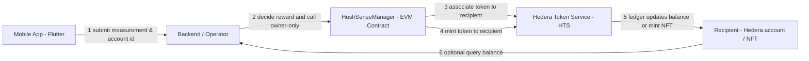

## Project Title & Track

Project: HushSense

Track: AI & DePIN

> **The World's Largest Decentralized Urban Noise Mapping Platform**

[](https://flutter.dev)
[](https://hedera.com)
[](LICENSE)

HushSense is a revolutionary **DePIN (Decentralized Physical Infrastructure Network)** platform that transforms smartphones into sophisticated urban noise sensors while leveraging blockchain technology for data integrity and user incentivization.

<p align="center">
  
</p>

## 🔗 Live Assets on Hedera Mainnet
- HTS Fungible Token (HUSH): [0.0.10048362](https://hashscan.io/mainnet/token/0.0.10048362)  
- Manager Smart Contract: [0.0.10047928](https://hashscan.io/mainnet/contract/0.0.10047928)  
- HTS NFT Collection: [0.0.10050668](https://hashscan.io/mainnet/token/0.0.10050668)

## 🎯 Vision & Mission

### **Vision**
To build the world's largest, most accurate, real-time urban noise map, empowering communities and organizations to create quieter, healthier, and more livable cities.

### **Mission**
Transform urban noise monitoring through community participation, turning every smartphone user into a citizen scientist contributing to a global noise pollution database.

### **Core Innovation**
- **Software DePIN Model**: No proprietary hardware required - leverages existing smartphones
- **Gamified Contribution**: Engaging user experience that rewards data collection
- **Privacy-First Architecture**: Users own and control their data through "Honest Data Approach"
- **Dual-Sided Marketplace**: Connects data contributors with data consumers (businesses, municipalities)

## 📦 Repository Structure

```
project-root/
├── mobile/                 # Flutter-based mobile application
│   ├── lib/               # Core application code
│   ├── assets/           # Application assets
│   └── test/             # Application tests
│
├── hushsense-smart-contract/    # Hedera smart contracts
│   ├── contracts/        # Smart contract source code
│   ├── scripts/          # Deployment and management scripts
│   └── test/            # Contract tests
│
└── hushsense-token-nft/  # Token and NFT management
    ├── hush-token/      # HUSH token creation and management
    └── hush-nft/        # NFT creation and management
```

 ## 🚀 Components

### 1. Mobile Application (Flutter)
- Cross-platform mobile app built with Flutter 3.24+
- Material Design 3 with custom theming
- Real-time noise measurement and visualization
- Blockchain wallet integration via HashConnect SDK
- Offline-first architecture with Hive database

### 2. Smart Contracts (Solidity)
- HushSense Manager Contract for ecosystem governance
- Token gating and reward distribution logic
- Upgradeable contract architecture
- Full mainnet deployment support

 ### 3. Token & NFT System
 - HUSH Token (HTS) for ecosystem incentives
 - NFT collection for achievement badges
 - IPFS-based metadata storage
 - Automated minting and distribution


## Hedera Integration Summary

Below are concise paragraphs describing each Hedera service used and why we chose it for HushSense.

Hedera Token Service (HTS)
- Purpose: HTS is used to create and manage the HUSH fungible token and the HushSense NFT collection. We chose HTS because it provides native token ledger support with low-cost on-ledger transfers and native NFT semantics, which simplifies token economics and reduces integration complexity compared to building a separate token layer.
- How we use it: Tokens are created with `TokenCreateTransaction` (scripts in `hushsense-token-nft/`) and NFTs are minted with `TokenMintTransaction`. The HUSH token's supply & pause keys are set to the deployed `HushSenseManager` contract so minting follows on-chain rules.

Hedera Smart Contract Service / EVM (HSCS)
- Purpose: The `HushSenseManager` contract enforces reward logic, performs token associations and mints via HTS precompiles. We use HSCS because it allows on-chain programmatic control over token minting with the familiarity of Solidity/EVM tooling (Hardhat), and direct access to HTS precompiles from contract code.
- How we use it: The contract calls the HTS precompile interface (`IHederaTokenService`) to run `associateToken(...)` and `mintToken(...)` from within the EVM context. Deployment and contract calls use `ContractCreateFlow` and `ContractExecuteTransaction` via the Hedera SDK.

Hedera SDK / Accounts & Node Connectivity
- Purpose: SDK primitives (Client, AccountId, PrivateKey) power deployments, transactions, and queries. We rely on the SDK because it provides robust, tested helpers to construct and sign Hedera transactions, interact with mirror/explorer endpoints, and manage fees.
- How we use it: All deployment and management scripts (in `hushsense-smart-contract/scripts/` and `hushsense-token-nft/`) use `@hashgraph/sdk` to connect to testnet/mainnet, set operator credentials and submit transactions.

### Transaction Types
These are the specific Hedera transactions and operations executed by the project (via SDK or from contract):
- ContractCreate (via `ContractCreateFlow`) — deploy `HushSenseManager` to Hedera EVM.
- ContractExecuteTransaction — call contract functions such as `initialize` and `mintReward`.
- ContractCallQuery — read contract state (optional helper queries in scripts).
- TokenCreateTransaction — create fungible HUSH token and NFT collection.
- TokenMintTransaction — mint NFT serials and token supply when needed.
- HTS precompile calls from contract: `associateToken(account, token)` and `mintToken(token, amount, metadata)` (executed from EVM contract using the IHederaTokenService precompile address).

### Economic Justification
Hedera provides low, predictable fees and high throughput with ABFT finality. For HushSense this matters because:
- Low predictable fees (sub-cent per transaction) keep operational costs low as the system scales and encourage frequent micro-rewards to users without eroding value.
- High throughput lets the system process many measurement-based reward events without queuing or latency spikes.
- ABFT finality provides fast, unavoidable finality which is important for transparent reward accounting and dispute resolution. Together these characteristics make Hedera an economically sustainable choice for a DePIN project focused on broad participation in African urban environments where low friction and predictable costs increase adoption.

## Deployment & Setup Instructions (Hedera Testnet)
Follow these steps to run the project locally and deploy to Hedera Testnet.

1) Clone the repo

```powershell
git clone https://github.com/JayeBlack/Project_Hushsense.git
cd Project_Hushsense
```

2) Prepare environment variables
- Copy the root `.env.example` to `.env` and fill in values (Hedera account, private key, HEDERA_NETWORK=testnet, etc.).

```powershell
copy .env.example .env
# Edit .env in your editor and fill the values
```

3) Mobile (Flutter) setup

```powershell
cd mobile
flutter pub get
# To run the mobile app on a device or emulator:
flutter run
```

4) Smart contracts (compile & deploy to Testnet)

```powershell
cd ..\hushsense-smart-contract
npm install
# compile
npx hardhat compile
# ensure .env has HEDERA_NETWORK=testnet and MY_ACCOUNT_ID/MY_PRIVATE_KEY_DER set
node scripts/deploy-hardhat.cjs
# copy the printed Contract ID into .env as HUSHSENSE_MANAGER_CONTRACT_ID
node scripts/initialise-contract.js
```

5) Token & NFT scripts (create token / mint NFTs)

```powershell
cd ..\hushsense-token-nft
npm install
# create HUSH token (set HUSHSENSE_MANAGER_CONTRACT_ID in .env first)
node hush-token/token.js
# create NFT collection
node hush-nft/nftCreate.js
# mint NFT (set HUSHSENSE_NFT_ID and NFT_METADATA_CID in .env)
node hush-nft/nftMint.js
```

## Running Environment
- Mobile: run via `flutter run` (on device/emulator). The mobile app connects to the backend API and displays account IDs, token balances and NFTs.
- Backend / scripts: Node.js scripts run locally and use `@hashgraph/sdk` to interact with Hedera Testnet; ensure `.env` contains operator credentials and HEDERA_NETWORK=testnet.
- Contracts: compiled with Hardhat and deployed via the Hedera SDK scripts in `hushsense-smart-contract/scripts/`.


## Deployed Hedera IDs (Testnet)
- NOTE: Testnet IDs will be generated when you run the deploy scripts above. After deploying, paste the values below into this README or into your `.env`:
  - HushSense Manager Contract ID (testnet): `HUSHSENSE_MANAGER_CONTRACT_ID=0.0.xxxxxx`
  - HUSH HTS Token ID (testnet): `HUSHSENSE_TOKEN_ID=0.0.xxxxxx`
  - HushSense NFT Collection ID (testnet): `HUSHSENSE_NFT_ID=0.0.xxxxxx`
  - Operator Hedera Account ID (testnet): set in `.env` as `MY_ACCOUNT_ID`

Existing mainnet assets (for reference):
- HTS Fungible Token (HUSH): [0.0.10048362](https://hashscan.io/mainnet/token/0.0.10048362)  
- Manager Smart Contract: [0.0.10047928](https://hashscan.io/mainnet/contract/0.0.10047928)  
- HTS NFT Collection: [0.0.10050668](https://hashscan.io/mainnet/token/0.0.10050668)

## 🔐 Environment / .env.example

An example `.env.example` is included at the repository root with sections for each sub-project and the variables they require. Copy it to `.env` and fill real values before running scripts.

## 🏛 Architecture Diagram

The runtime architecture (Mobile → Backend → Smart Contract → HTS) is shown below.



## 🛠️ Development Setup

### Prerequisites
- Node.js v18 or later
- Flutter 3.24+
- Hedera account with HBAR
- VS Code or preferred IDE

### Quick Start
1. Clone the repository:
```bash
git clone https://github.com/JayeBlack/Project_Hushsense.git
cd Project_Hushsense
```

2. Set up the mobile app:
```bash
cd mobile
flutter pub get
```

3. Set up smart contracts:
```bash
cd ../hushsense-smart-contract
npm install
```

4. Set up token management:
```bash
cd ../hushsense-token-nft
npm install
```

## 📜 License
This project is licensed under the Apache License 2.0 - see the [LICENSE](LICENSE) file for details.

## 🤝 Contributing
Contributions are welcome! Please feel free to submit a Pull Request.

## 📬 Contact
For questions and support, please open an issue in the repository.
